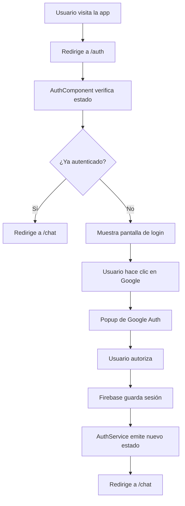

# Sistema de Autenticación - Angular 20 + Firebase

## 📋 Resumen General

Esta aplicación utiliza **Firebase Authentication** con Google como proveedor para manejar el registro, login y logout de usuarios. El sistema está implementado de forma reactiva utilizando observables de RxJS para mantener el estado de autenticación en toda la aplicación.

## 🔐 Componentes del Sistema de Autenticación

### 1. AuthService - El Corazón de la Autenticación

El servicio `AuthService` (`src/app/services/auth.service.ts`) es el núcleo del sistema de autenticación y maneja:

#### Propiedades Principales:
- **`usuario$`**: Observable que emite cada vez que cambia el estado de autenticación
- **`estaAutenticado$`**: Observable booleano que indica si hay un usuario autenticado
- **`auth`**: Instancia del servicio de Firebase Authentication

#### Métodos Clave:

**🚪 Login con Google**
```typescript
async iniciarSesionConGoogle(): Promise<Usuario | null>
```
- Abre un popup de Google para autenticación
- Solicita permisos de email y profile
- Convierte los datos de Firebase al modelo `Usuario` de la aplicación
- Retorna un objeto `Usuario` con: uid, email, nombre, fotoUrl, fechaCreacion, ultimaConexion

**🚪 Logout**
```typescript
async cerrarSesion(): Promise<void>
```
- Utiliza `signOut()` de Firebase para cerrar la sesión
- Limpia automáticamente el estado de autenticación

**👤 Obtener Usuario Actual**
```typescript
obtenerUsuarioActual(): User | null
```
- Retorna el usuario actualmente autenticado desde Firebase
- Retorna `null` si no hay usuario autenticado

### 2. AuthComponent - Pantalla de Login

El componente `AuthComponent` (`src/app/components/auth/`) es la primera pantalla que ve el usuario:

#### Funcionalidades:
- **Botón "Continuar con Google"**: Inicia el proceso de autenticación
- **Manejo de errores**: Muestra mensajes específicos según el tipo de error
- **Estados de carga**: Indica cuando se está procesando la autenticación
- **Auto-redirección**: Si el usuario ya está autenticado, redirige automáticamente al chat

#### Flujo de Autenticación:
1. Usuario hace clic en "Continuar con Google"
2. Se abre popup de Google Authentication
3. Usuario autoriza la aplicación
4. Se obtienen los datos del usuario (email, nombre, foto)
5. Se crea/actualiza la sesión en Firebase
6. Redirección automática a `/chat`

### 3. Modelo de Usuario

La interfaz `Usuario` (`src/app/models/usuario.model.ts`) define la estructura de datos:

```typescript
interface Usuario {
  uid: string;           // ID único de Firebase
  email: string;         // Correo electrónico verificado
  nombre: string;        // Nombre completo del usuario
  fotoUrl?: string;      // URL de la foto de perfil (opcional)
  fechaCreacion: Date;   // Fecha de creación de la cuenta (requerido)
  ultimaConexion: Date;  // Última conexión del usuario (requerido)
}
```

## 🔄 Flujo Completo de Autenticación

### 1. **Inicio de Sesión**



### 2. **Verificación de Estado**

La aplicación verifica constantemente el estado de autenticación mediante:

```typescript
// En AuthComponent
this.authService.estaAutenticado$.subscribe(autenticado => {
  if (autenticado) {
    this.router.navigate(['/chat']);
  }
});

// En ChatComponent
private async verificarAutenticacion(): Promise<void> {
  this.usuario = this.authService.obtenerUsuarioActual();
  
  if (!this.usuario) {
    await this.router.navigate(['/auth']);
    throw new Error('Usuario no autenticado');
  }
}
```

### 3. **Persistencia de Sesión**

Firebase mantiene automáticamente la sesión del usuario:
- **LocalStorage**: La sesión se guarda en el navegador
- **Auto-renovación**: Firebase renueva automáticamente los tokens
- **Estado reactivo**: Los observables se actualizan cuando cambia el estado

## 📱 Cómo Funciona en la Aplicación

### **Al Iniciar la Aplicación:**

1. **Rutas**: `app.routes.ts` redirige por defecto a `/auth`
2. **AuthComponent**: Se inicializa y verifica si hay usuario autenticado
3. **Si hay sesión activa**: Redirige automáticamente a `/chat`
4. **Si no hay sesión**: Muestra botón de login con Google

### **Durante el Uso:**

1. **ChatComponent**: Verifica autenticación en `ngOnInit()`
2. **Datos del usuario**: Se obtienen de `this.authService.obtenerUsuarioActual()`
3. **Información mostrada**:
   - **Email**: `usuario.email` 
   - **Nombre**: `usuario.displayName`
   - **Foto**: `usuario.photoURL`

### **Al Cerrar Sesión:**

```typescript
// En cualquier componente
async cerrarSesion() {
  await this.authService.cerrarSesion();
  // Firebase automáticamente limpia el estado
  // Los observables se actualizan
  // La aplicación redirige a /auth
}
```

## 🎯 Información de Usuario Disponible

### **Datos que se Obtienen de Google:**

- **`uid`**: Identificador único de Firebase (permanente)
- **`email`**: Correo electrónico verificado de Google
- **`nombre`**: Nombre completo del perfil de Google (antes displayName)
- **`fotoUrl`**: URL de la foto de perfil de Google (antes photoURL)
- **`fechaCreacion`**: Fecha de creación de la cuenta
- **`ultimaConexion`**: Última vez que el usuario se conectó

### **Dónde se Almacena:**

1. **Firebase Authentication**: Maneja la sesión y tokens
2. **LocalStorage del navegador**: Persiste la sesión localmente
3. **Memoria de la aplicación**: Variables como `this.usuario` en componentes
4. **Observables**: Estado reactivo en toda la aplicación

### **Cómo se Recupera:**

```typescript
// Obtener usuario actual (síncrono)
const usuario = this.authService.obtenerUsuarioActual();

// Escuchar cambios de estado (reactivo)
this.authService.usuario$.subscribe(usuario => {
  if (usuario) {
    console.log('Email:', usuario.email);
    console.log('Nombre:', usuario.displayName);
    console.log('Foto:', usuario.photoURL);
  }
});
```

## 🛡️ Seguridad y Protección

### **Validaciones Implementadas:**

1. **Verificación en cada ruta**: ChatComponent verifica autenticación
2. **Manejo de errores**: Diferentes mensajes según el tipo de error
3. **Estados de carga**: Previene múltiples intentos de login
4. **Auto-logout**: Firebase maneja automáticamente tokens expirados

### **Implementación Actual de Seguridad:**

```typescript
/**
 * Auth Guard - Protección de Rutas
 * 
 * Este guard se ejecuta antes de navegar a una ruta protegida para verificar
 * si el usuario está autenticado. Si no lo está, puede redirigir al login.
 */
@Injectable({
  providedIn: 'root'
})
export class AuthGuard implements CanActivate {
  
  private authService = inject(AuthService);
  private router = inject(Router);

  canActivate(): Observable<boolean> {
    return this.authService.estaAutenticado$.pipe(
      tap(estaAutenticado => {
        if (!estaAutenticado) {
          console.log('🚫 Acceso denegado - Usuario no autenticado');
          this.router.navigate(['/auth']);
        } else {
          console.log('✅ Acceso permitido - Usuario autenticado');
        }
      }),
      map(estaAutenticado => estaAutenticado)
    );
  }
}
```

## 🔧 Configuración Técnica

### **Firebase Configuration:**

La configuración de Firebase se encuentra en:
- `src/environments/environment.ts` (desarrollo)
- `src/environments/environment.prod.ts` (producción)

### **Configuración de Angular Fire:**

```typescript
// En app.config.ts
export const appConfig: ApplicationConfig = {
  providers: [
    // Configuración global de errores y optimización
    provideBrowserGlobalErrorListeners(),
    provideZoneChangeDetection({ eventCoalescing: true }),
    
    // Router y HTTP
    provideRouter(routes),
    provideHttpClient(),
    
    // Firebase
    provideFirebaseApp(() => initializeApp(environment.firebaseConfig)),
    provideAuth(() => getAuth()),
    provideFirestore(() => getFirestore())
  ]
}
```

### **Dependencias Principales:**

- `@angular/fire/auth`: Integración de Firebase Auth con Angular
- `firebase/auth`: SDK de Firebase Authentication
- `rxjs`: Para manejo reactivo de estados

## 📝 Ejemplo de Uso Completo

```typescript
@Component({
  selector: 'app-auth',
  standalone: true,
  imports: [CommonModule],
  templateUrl: './auth.html',
  styleUrl: './auth.css'
})
export class AuthComponent implements OnInit {
  private authService = inject(AuthService);
  private router = inject(Router);
  
  // Variables de estado
  autenticando = false;
  mensajeError = '';

  ngOnInit(): void {
    // Verificar si ya está autenticado
    this.authService.estaAutenticado$.subscribe(autenticado => {
      if (autenticado) {
        this.router.navigate(['/chat']);
      }
    });
  }

  async iniciarSesionConGoogle(): Promise<void> {
    this.mensajeError = '';
    this.autenticando = true;
    
    try {
      const usuario = await this.authService.iniciarSesionConGoogle();
      
      if (usuario) {
        await this.router.navigate(['/chat']);
      } else {
        this.mensajeError = 'No se pudo obtener la información del usuario';
      }
      
    } catch (error: any) {
      // Manejo específico de errores de Firebase
      if (error.code === 'auth/popup-closed-by-user') {
        this.mensajeError = 'Has cerrado la ventana de autenticación.';
      } else if (error.code === 'auth/popup-blocked') {
        this.mensajeError = 'Tu navegador bloqueó la ventana de autenticación.';
      } else if (error.code === 'auth/network-request-failed') {
        this.mensajeError = 'Error de conexión. Verifica tu internet.';
      } else {
        this.mensajeError = 'Error al iniciar sesión. Por favor intenta de nuevo.';
      }
      
    } finally {
      this.autenticando = false;
    }
  }
}
```

## 🎯 Puntos Clave

1. **Todo es reactivo**: El estado se propaga automáticamente por toda la app
2. **Firebase maneja la persistencia**: No necesitas guardar tokens manualmente
3. **Google como único proveedor**: Simplifica el flujo de autenticación
4. **Verificación en cada pantalla**: Garantiza que solo usuarios autenticados accedan al chat
5. **Manejo robusto de errores**: Diferentes mensajes según el tipo de problema
6. **Auto-redirección inteligente**: La app sabe cuándo redirigir automáticamente

Este sistema proporciona una experiencia de usuario fluida y segura, manteniendo la sesión activa entre visitas y manejando automáticamente la renovación de tokens y la persistencia de datos.
